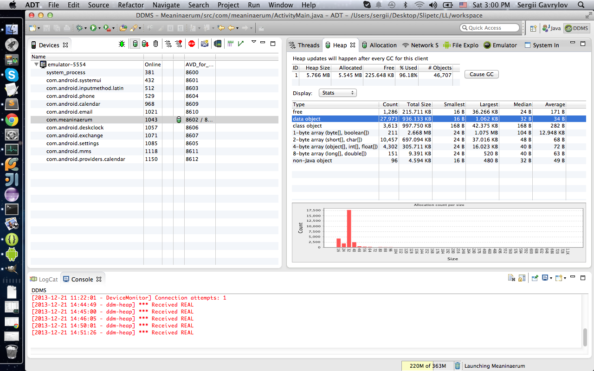
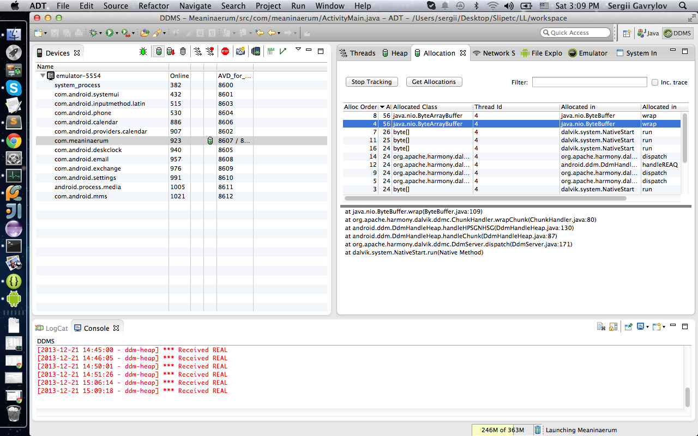

Meaninaerum
===========

Meaning + Imaginaerum = Meaninaerum

Definition of <b>mean</b> in English:
 1. intend to convey or refer to (a particular thing); signify
 2. intend (something) to occur or be the case
 3. have as a consequence or result
 
(c) Oxford dictionary of Enflish

Are you still sure you know the definition of English words?

<i>"Meaninaerum"</i> can help you to check your knowledge.
Your score will hit up each time you pick up the right word definition, try yourself at different levels and compete with friends for the title of King of Meaninaerum. 
Learn more!

####Developers:
* Anastasiia Vasenko
* Sergii Gavrylov

####Specifications:
Our application uses no more than 4 MB of memory, so it can be launched on almost any device.

